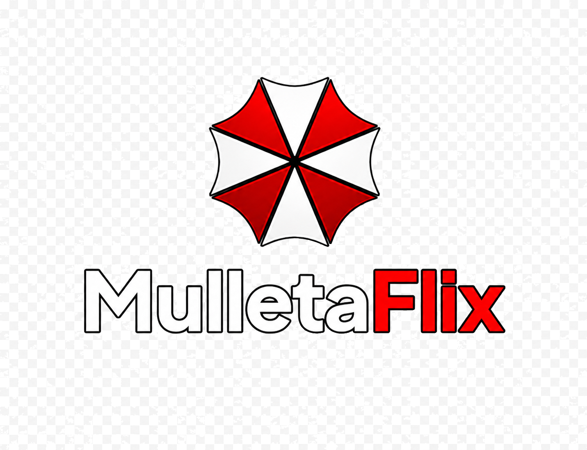

<h1 align="center">MulletaFlix</h1>
<h3 align="center">A refined, performance-focused variation of Jellyfin</h3>

---

<p align="center">

<br/>
<br/>
<a href="https://github.com/raphaelpera85/MulletaFlix-packaging">

</a>
<a href="https://github.com/raphaelpera85/MulletaFlix/releases">

</a>
<a href="https://github.com/raphaelpera85/MulletaFlix-web-master">

</a>
<a href="https://github.com/raphaelpera85/MulletaFlix-master">

</a>
</p>

---

MulletaFlix is a customized evolution of Jellyfin focused on a cleaner experience, stronger media workflows, and better day-to-day responsiveness. It keeps the spirit of Jellyfin as a free and open media system, while pushing the product in a more polished direction for local streaming, audiobooks, and richer media libraries.

This repository contains the packaging, build scripts, and Windows installer resources used to ship MulletaFlix. The custom Windows UX assets are versioned alongside the installer flow in `MulletaFlix-ux-custom`, so branding and packaging stay in sync.

## What Makes MulletaFlix Different

### Media Experience

- Improved audiobook and book playback flow.
- TTS now continues from the current page instead of restarting from the beginning.
- Cover generation uses the first page of the book by default.
- Better handling of different book file formats in tests and validation.

### Performance and Responsiveness

- Focused cleanups to reduce friction in common navigation and playback paths.
- Faster recovery when moving through pages and media items.
- More predictable behavior in rendering, metadata handling, and media-related flows.
- Better packaging discipline so generated artifacts do not clutter the source tree.

### Plugins and Extensibility

- Plugin-friendly packaging and update flow.
- Custom branding and UI assets kept alongside the installer definitions.
- Support for the broader MulletaFlix plugin ecosystem, including provider and metadata workflows.
- Room for media providers, library metadata, search, and import/export style plugins.
- Windows installer assets aligned with the MulletaFlix identity.

### Quality and Test Coverage

- Test coverage for book files with multiple extensions.
- Verification for `G:\Meu Drive\Livros` samples during development.
- More explicit handling of media and packaging assets.

## Repository Layout

- `jellyfin-server` - server submodule used for packaging.
- `jellyfin-web` - web UI submodule used for packaging.
- `jellyfin-server-windows` - Windows tray app and installer submodule.
- `MulletaFlix-ux-custom` - custom branding assets used by the Windows installer.
- `build.py` - orchestration for the packaging workflows.
- `docker` - Docker image definitions.
- `debian` - Debian and Ubuntu package definitions.
- `portable` - archive/portable build logic.

## Quickstart

To build MulletaFlix packages locally, you need:

- An amd64 Linux environment, preferably Debian or Ubuntu.
- Docker.
- Python 3.
- `PyYAML` and `git` for the build scripts.

### Steps

1. Install Docker.
1. Clone this repository.
1. Initialize the submodules:

```bash
git submodule update --init
```

1. Sync the server and web submodules to the intended revision:

```bash
./checkout.py master
```

1. Build the desired target with `build.py`.

### Examples

Build a Debian package:

```bash
./build.py auto debian amd64 trixie
```

Build a Windows archive:

```bash
./build.py auto windows amd64
```

Build a portable .NET package:

```bash
./build.py auto portable
```

Build a Docker image:

```bash
./build.py auto docker amd64 --local
```

## Windows UX Assets

The Windows installer branding is stored in:

`MulletaFlix-ux-custom/branding/`

That folder contains the banner, installer art, and NSIS assets used by the packaging flow. Keeping these assets here makes it easier to maintain a consistent MulletaFlix identity across releases.

## Windows Installer Notes

The Windows installer is built from the `jellyfin-server-windows` submodule, with MulletaFlix-specific assets supplied by this repository.

If you are building the installer manually, use the bundled branding path:

```powershell
.\makensis /Dx64 /DUXPATH=C:\Path\To\MulletaFlix-ux-custom "C:\Path\To\jellyfin-server-windows\nsis\jellyfin.nsi"
```

The installer expects these branding files:

- `modern-install.ico`
- `installer-header.bmp`
- `installer-right.bmp`

### Local MulletaFlix build flow

From the workspace root, the maintained build script prepares the stage, validates its contents and compiles the NSIS installer:

```powershell
powershell -ExecutionPolicy Bypass -File .\MulletaFlix-packaging-master\build-stage-and-installer.ps1 -NoPause
```

To validate an existing stage without rebuilding it:

```powershell
powershell -ExecutionPolicy Bypass -File .\MulletaFlix-packaging-master\scripts\validate-stage.ps1
```

Em uma VM Windows limpa, execute o smoke test elevado para validar instalação,
serviço, endpoint de readiness, permissões do `NetworkService`, tray e
desinstalação:

```powershell
powershell -ExecutionPolicy Bypass -File .\MulletaFlix-packaging-master\scripts\Test-CleanInstaller.ps1 `
  -InstallerPath .\MulletaFlix-packaging-master\jellyfin-server-windows\nsis\mulletaflix_12.0.0_windows-x64.exe `
  -ExpectedSha256 65DA3C8BA86E273B24E543CB20C19CC830C7F10F820867E6A18ACABE59ADA0BB
```

O script exige uma sessão administrativa; para solicitar elevação UAC
automaticamente, acrescente `-AutoElevate`. Ele instala silenciosamente em
`Program Files`, aguarda o serviço responder em `/ready`, verifica a ACL do
diretório de dados isolado informado por `-DataDirectory` e sempre tenta
desinstalar no bloco `finally`. O instalador encaminha esse valor ao NSIS por
`/DATA=...`, evitando que o smoke test escreva em `ProgramData`.

The installer compiler requires NSIS 3.x (`makensis.exe`). The generated executable is written under `MulletaFlix-packaging-master\jellyfin-server-windows\nsis\`. The stage validator checks required server binaries, web assets including `serviceworker.js`, helper scripts, absence of legacy Nebula artifacts and absence of temporary stage backups before compilation. Run it directly with `powershell -ExecutionPolicy Bypass -File .\MulletaFlix-packaging-master\scripts\validate-stage.ps1`.

## Why This Fork Exists

MulletaFlix exists to provide a more tailored, polished Jellyfin-derived experience for users who want:

- clearer media workflows,
- better audiobook and book behavior,
- more deliberate performance work,
- and packaging that stays aligned with the project branding.

This repository is the packaging home for that work.

## Release Notes

For release history, use the GitHub releases page and the commit history of the relevant repository:

- [MulletaFlix releases](https://github.com/raphaelpera85/MulletaFlix/releases)
- [MulletaFlix packaging](https://github.com/raphaelpera85/MulletaFlix-packaging)
- [MulletaFlix web UI](https://github.com/raphaelpera85/MulletaFlix-web-master)
- [MulletaFlix server](https://github.com/raphaelpera85/MulletaFlix-master)

## License

MulletaFlix remains free software and follows the licensing of the upstream project and its packaging components. See the repository files and release artifacts for exact licensing details.
